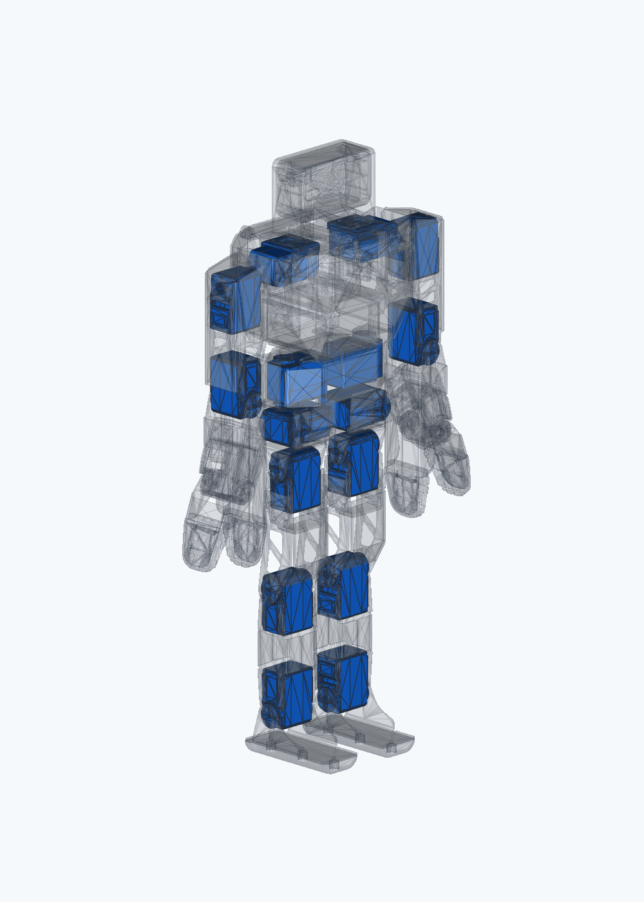

# Zeroth-01 Physical Mount V1

这是替代旧版“蓝色舵机包络叠加图”的机械基线。旧图只适合标位置，不能证明舵机可安装、可传动或左右对称；本版直接从 Zeroth/K-Scale 已装配的原始 STL 中拆出 16 个舵机实体，并保留它们在承力件中的原坐标、原关节轴和父子链。

## 当前结论

| 项目 | 结果 | 含义 |
|---|---:|---|
| 原装配舵机实体提取 | PASS，16/16 | 每个蓝色件都来自原始装配网格，不是重新摆放的长方体 |
| 舵机壳体—输出轴偏置 | PASS，16/16 | 实测约 12.5 mm，与 FEETECH STS32xx 图纸一致 |
| 肩、肘严格左右镜像 | PASS | 轴线/壳体镜像误差约 0.02–0.16 mm |
| 髋 yaw/roll 传动轴镜像 | PASS | hip-roll 两侧沿输出轴的壳体方向不同，不影响轴线重合 |
| hip-pitch、膝、踝严格镜像 | REVIEW | 原始源模型自带约 1.45–1.48 mm 横向偏差；未擅自移动舵机掩盖问题 |
| MuJoCo 非相邻件干涉 | PASS | 中位姿 0；每关节 61 点全程 0；73 个协调动作姿态 0 |
| SolidWorks 分件装配 | PASS | 36 个分件、20 个刚性子装配、16 个蓝色舵机件 |
| STS3250 首件量规 CAD | PASS | STEP/STL 均为闭合有效几何 |
| 整机直接打印 | **HOLD** | 必须先拿一颗实物 STS3250 验证 4×M2、25T 舵盘和后轴支撑 |

因此，答案不是“已经可以无条件打印整机”，而是：

- 旧图确实不能证明安装与传动，现已废止。
- 本版证明了原 Zeroth-01 的 STS3215-family 安装实体、承力件与关节轴属于同一条真实装配链。
- STS3250 与该家族的名义外形和轴系接近，但完整螺孔公差尚未由实物签核，所以整机打印仍保持 HOLD。

## 为什么旧图看起来左右不对称

旧版把 16 个蓝色包络按父坐标系放在白色模型外面，仅用于“编号可见性”。它没有使用原网格中已经存在的舵机区域，也没有把包络固定到对应承力件，因此肩、髋、肘会出现漂浮、交叉和左右姿态不一致。

原 Zeroth-01 STL 又把舵机、法兰、舵盘和承力件合并成同色三角网格，所以普通显示下看不到独立舵机。Physical Mount V1 按连通区域拆分后：

- 白色：原承力件、法兰、舵盘/连接结构；
- 蓝色：原装配内嵌的 STS3215-family 舵机实体；
- 每个蓝色件与所属 link 保持单位变换，不再人为平移或旋转；
- 关节运动仍使用原 URDF 的 parent、child、origin 和 axis。

透视图：

协调动作：

## 16 个舵机与承力件

| ID | 关节 | 舵机实体所在承力 link | 相对关节 |
|---|---|---|---|
| S01 | right_shoulder_pitch | 3215_1Flange_2 | child |
| S02 | left_shoulder_pitch | 3215_1Flange | child |
| S03 | right_shoulder_yaw | Z_BOT2_MASTER_BODY_SKELETON | parent |
| S04 | right_hip_pitch | 3215_BothFlange_10 | child |
| S05 | left_hip_pitch | 3215_BothFlange_9 | child |
| S06 | left_shoulder_yaw | Z_BOT2_MASTER_BODY_SKELETON | parent |
| S07 | right_hip_yaw | Z_BOT2_MASTER_BODY_SKELETON | parent |
| S08 | left_hip_yaw | Z_BOT2_MASTER_BODY_SKELETON | parent |
| S09 | right_elbow_yaw | 3215_1Flange_2 | parent |
| S10 | left_elbow_yaw | 3215_1Flange | parent |
| S11 | right_hip_roll | 3215_BothFlange_6 | child |
| S12 | left_hip_roll | 3215_BothFlange_5 | child |
| S13 | right_knee_pitch | 3215_BothFlange_14 | child |
| S14 | left_knee_pitch | 3215_BothFlange_13 | child |
| S15 | right_ankle_pitch | 3215_BothFlange_14 | parent |
| S16 | left_ankle_pitch | 3215_BothFlange_13 | parent |

完整坐标、源 region、SHA256、轴距与镜像误差分别在：

- `reports/physical_mount_v1/servo_component_manifest.csv`
- `reports/physical_mount_v1/kinematic_mount_audit.csv`
- `config/physical_mount_v1_source_regions.json`

## STS3250 边界

FEETECH 官方 STS3250 图纸给出：

- 壳体名义尺寸 45.22 × 24.72 × 35 mm；
- 双输出总深度 36.5 mm；
- 输出轴距短端 12.5 mm；
- 25T、外径约 5.9 mm；
- 输出固定螺钉 M3×6；
- 壳体安装 4×M2；
- 质量 74.5±1 g；
- 12 V 额定扭矩 16 kg·cm，堵转扭矩 50 kg·cm。

官方资料：

- STS3250：<https://www.feetechrc.com/Data/feetechrc/upload/file/20240120/6384135881578380868917773.pdf>
- STS3215：<https://www.feetechrc.com/Data/feetechrc/upload/file/20200611/6372749961523760249976542.pdf>

蓝色 SolidWorks 零件被明确命名为 `INSTALLED_STS3215_FAMILY_REFERENCE`，因为它们来自原 Zeroth 装配，而不是供应商发布的精确 STS3250 B-Rep。精确尺寸控制另有：

- `generated/cad/physical_mount_v1/sts3250_interface/FEETECH_STS3250_C001_DIMENSION_REFERENCE.step`
- `generated/cad/physical_mount_v1/sts3250_interface/STS3250_4XM2_FIRST_ARTICLE_FACE_GAUGE.step`
- `generated/print/physical_mount_v1/first_article/STS3250_4XM2_FIRST_ARTICLE_FACE_GAUGE.stl`

量规的 36.8 × 20.5 mm 孔距是依据图纸轮廓/边距重建的待验证值，不冒充供应商公差尺寸。

## SolidWorks

先打开：

`generated/solidworks/physical_mount_v1/OPEN_FIRST_ZEROTH01_PHYSICAL_MOUNT_V1_16_BLUE_SERVOS.SLDASM`

结构：

- `parts/skeleton/`：20 个白色承力 surface parts；
- `parts/servos/`：16 个蓝色原装配舵机 reference parts；
- `links/`：20 个固定 link 子装配，每个包含承力件和属于该 link 的舵机；
- 顶层装配：按 URDF 正运动学变换摆放 20 个 link 子装配；
- `ZEROTH01_PHYSICAL_MOUNT_V1_16_BLUE_SERVOS_XRAY.SLDASM`：透视复核版。

上游只发布 STL，SolidWorks 因此保存的是原尺寸 surface parts，不是带圆柱面配合、孔特征树和原生 Motion 接触的参数化 B-Rep。当前 GIF 证明的是 SolidWorks 装配变换可执行；几何干涉门由详细网格 MuJoCo 扫描独立完成。

## RL 入口

主 URDF：

`generated/urdf/physical_mount_v1/zeroth01_physical_mount_v1.urdf`

关键数据：

- 16 个 revolute joints，左右名称显式化；
- 两个 gripper 固定，因此不虚增执行器；
- 总质量 4.064411 kg；
- 每颗 STS3250 按 74.5 g 计入，原 55 g 舵机质量用每颗 +19.5 g 点质量修正；
- URDF effort 使用 12 V 额定扭矩 1.569 N·m，不用 4.903 N·m 堵转值训练持续动作；
- 每关节 guarded limits 已写入 URDF；
- 舵机总线 ID、方向符号、硬件零位均标为必须实机标定，不伪造；
- 1000 个全 16D 独立随机姿态中有 117 个自碰撞是诊断结果，RL 必须保留自碰撞惩罚/终止，不能把各关节独立极限的笛卡尔积当作全局安全域。

执行器与不确定性：

- `generated/config/physical_mount_v1_actuators.json`
- `generated/config/physical_mount_v1_hardware_calibration_template.csv`
- `generated/config/physical_mount_v1_rl_handoff.json`
- `config/physical_mount_v1_guarded_limits.json`

质量/惯量当前是“开源源模型 + STS3250 质量增量”的工程基线。电池、算力板、屏幕、线束和最终打印件必须在实物完成后称重、测质心并回写；在此之前 RL 应按 handoff JSON 的建议做质量、质心、摩擦和扭矩域随机化。

## 打印顺序

不要先打印整机：

1. 打印 4×M2 首件量规；
2. 用一颗实际购买的 STS3250 验证孔距、螺纹深度、35/36.5 mm 深度、25T 舵盘和后轴；
3. 只打印一个肩部模块和一个髋部模块，检查装入、锁紧、线束出口和全行程；
4. 把实测尺寸写入 `reports/physical_mount_v1/first_article_measurements.csv`；
5. 修正承力件并重新跑轴线、干涉和 SolidWorks gate；
6. 以上全部通过后才把整机打印状态从 HOLD 改为 RELEASED。

详见 `ASSEMBLY_FIRST_ARTICLE_zh.md`。

## 可审计门

- `reports/physical_mount_v1/source_component_gate.json`
- `reports/physical_mount_v1/kinematic_mount_audit.json`
- `reports/physical_mount_v1/dynamic_collision_gate.json`
- `reports/physical_mount_v1/solidworks_physical_mount_gate.json`
- `reports/physical_mount_v1/sts3250_interface_gauge.json`

这些门分别回答“来自哪里、轴是否对、是否干涉、SolidWorks 是否分件、能否进入实物首件”，不能互相替代。
