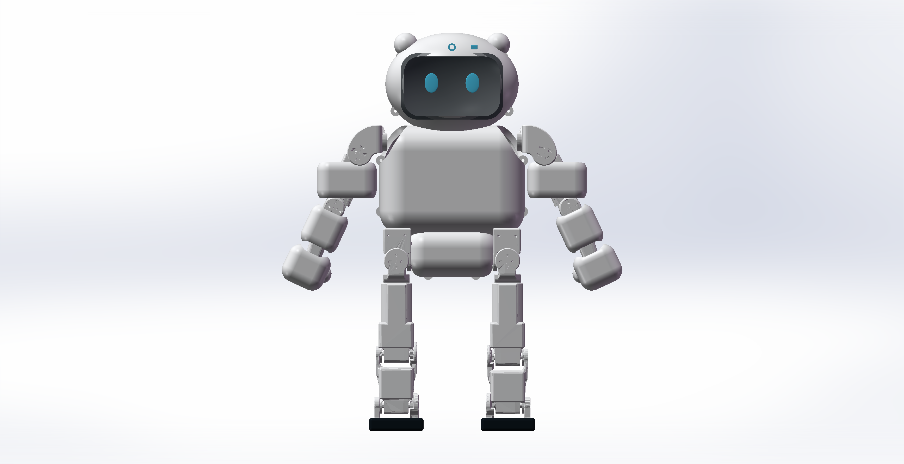
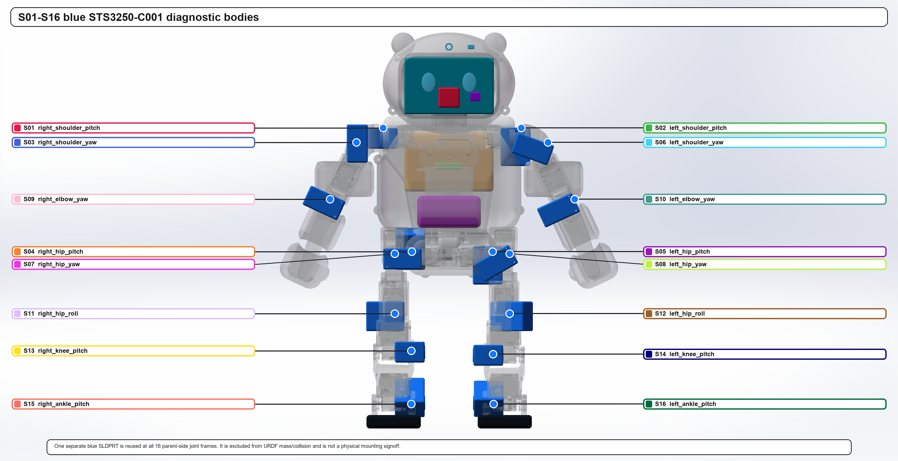
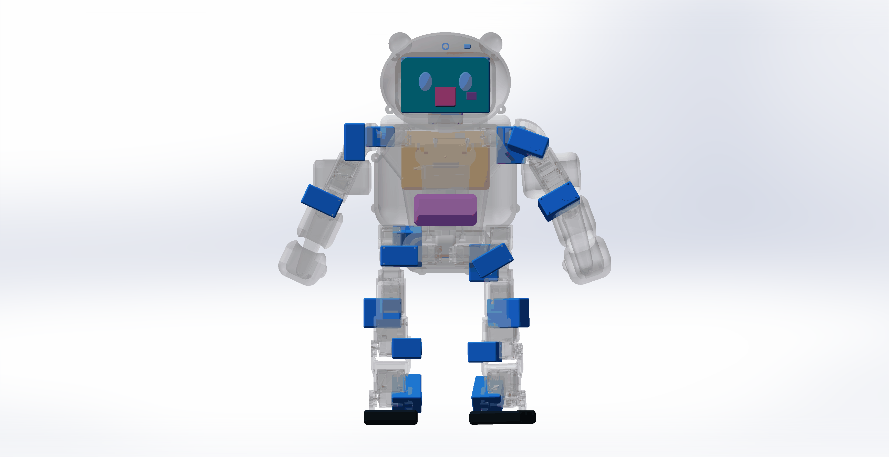

# Zeroth-01 white Eva-style 16-DoF RL mechanical package

This revision keeps the previously validated Zeroth-01 17-link / 16-moving-joint mechanism and makes only reversible exterior changes: a white rounded body, thicker soles, a Poppy-Eva-derived screen head with two small ears, rounded arm sleeves, and fixed chibi mitten palms.

## Open first

| Purpose | File |
|---|---|
| Opaque white SolidWorks assembly | `generated/solidworks/round_v1/ZEROTH01_ROUND_V3_WHITE_EXTERIOR.SLDASM` |
| X-ray SolidWorks assembly with all motors visible | `generated/solidworks/round_v1/OPEN_FIRST_ZEROTH01_ROUND_V3_WHITE_EVA_16_BLUE_SERVOS_XRAY.SLDASM` |
| One reusable blue servo part | `generated/solidworks/round_v1/parts/ZEROTH01_STS3250_C001_BLUE_DIAGNOSTIC.SLDPRT` |
| STEP review assembly | `generated/cad/round_v1/ZEROTH01_ROUND_V3_WHITE_EVA_16_BLUE_SERVOS_ASSEMBLY.step` |
| RL URDF | `generated/urdf/zeroth01_rl_round_v1.urdf` |
| MuJoCo model | `generated/mujoco/zeroth01_rl_round_v1.xml` |
| One-line RL prompt | `one-seq.md` |

## What changed

- Replaced the earlier large bear treatment with two small solid ear tabs on a white egg-shaped front/back head shell.
- Added one continuous rounded black screen with filled cyan display eyes; there are no protruding eye or muzzle solids.
- Selected a Waveshare 4.3-inch DSI/QLED 800×480 display envelope; camera and ToF sit behind forehead windows.
- Kept the rounded chest/pelvis and 8 mm thicker sole concept.
- Added removable rounded upper-arm and forearm sleeves plus fixed non-dexterous chibi mitten palms.
- Replaced the old colored joint disks with one separate blue STS3250-C001 diagnostic `.SLDPRT`, reused at S01–S16.

The servo review part is constrained to `45.22 × 24.72 × 36.5 mm`. Its local +Z output axis is collinear with each canonical URDF joint axis and its shaft origin is coincident with the joint origin.

## Important semantics

The 16 blue servo instances are visibility overlays, not sixteen extra robot bodies. They are excluded from URDF visual/collision/inertial data and their mass is not added again. The upstream aggregate link meshes remain the mechanical baseline.

This repository does not claim that the blue bodies prove a manufacturable mount. Exact C001 mounting ears, connector keep-outs, fasteners, bearings, cable routing, tolerances, and physical interference still require a traceable native CAD model or measured hardware.

## Current validated model

- URDF: 26 links, 25 joints, 16 moving joints.
- MuJoCo: 16 actuators, 8 sensors, one head camera.
- Nominal total mass: `4.997342616724 kg`.
- MuJoCo 1000-step finite-state / mass-consistency smoke test: `PASS`.
- Fifteen selected printable meshes: watertight, winding-consistent, zero boundary/nonmanifold edges, STEP/STL volume error ≤0.5%: `PASS`.
- Six arm-sleeve/palm fit checks against conservative source-link convex hulls: `0 mm³` intersection: `PASS`.
- 100,000 random poses and all 65,536 joint-limit corner combinations: zero reported self-collision samples.
- All 16 diagnostic servo axes: origin error `0 mm`; collinearity error below `0.000002°`: `PASS`.

See `DESIGN_LEDGER.md` and `reports/` for the assumption and gate boundary.

## Open-source head provenance

The head topology is derived from the official [Poppy Eva head design](https://github.com/poppy-project/Poppy-eva-head-design), commit `844654a0b29fb771c23b7400997d1de3d42e0e2e`, licensed CC BY-SA 4.0. It was rebuilt parametrically around Zeroth-01 shoulder keep-outs rather than scaling the source STL.

The selected display reference is the official [Waveshare 4.3inch DSI QLED](https://www.waveshare.com/product/4.3inch-dsi-qled.htm).

## Hardware gate

Use `1.2552512 N·m` as the initial continuous-torque reference; never use stall torque as the PPO continuous action limit. The palms are fixed cosmetic shells, not dexterous hands. Hardware walking remains blocked until printed/display fit checks, exact electronics, per-link weighing, servo ID/zero/direction calibration, harness sweep, dual-leg rig, and thermal tests are complete.
