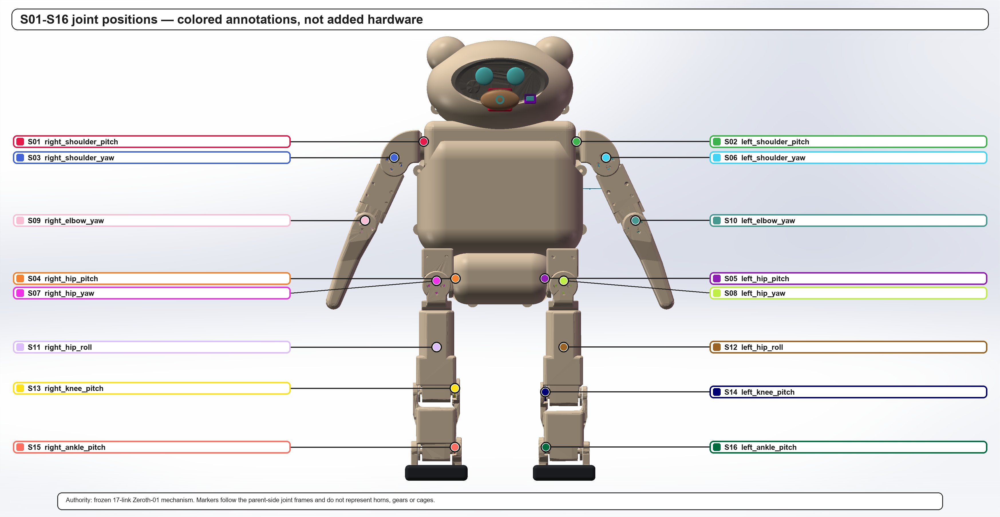
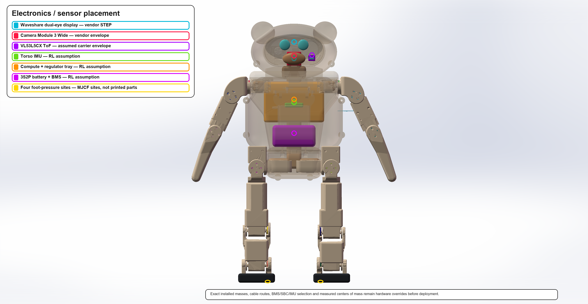
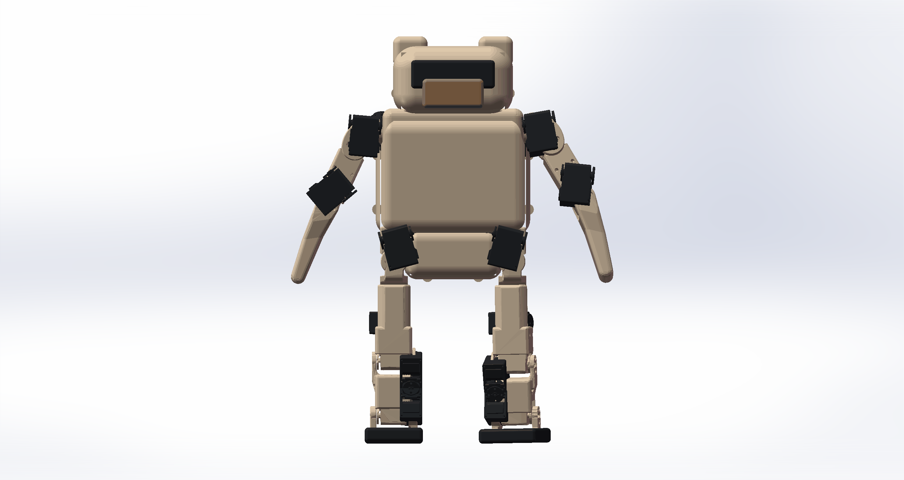

# Zeroth-01 minimal-cosmetic RL mechanical package

This revision preserves the assembled, collision-checked Zeroth-01 17-link mechanism as the only mechanical authority. It adds a rounded ellipsoid head, compound-curved visor, rounded torso/pelvis shells, thicker soles, head electronics envelopes, and stable colored annotations without altering any joint axis, parent/child relation, zero pose, or guarded limit.

## Canonical RL files

- [URDF](generated/urdf/zeroth01_rl_round_v1.urdf)
- [MuJoCo MJCF](generated/mujoco/zeroth01_rl_round_v1.xml)
- [Actuator metadata](generated/config/zeroth01_actuator_metadata.json)
- [Mass properties](generated/config/round_v1_mass_properties.json)
- [Electronics and sensor layout](generated/config/round_v1_electronics_sensor_layout.json)
- [Collision policy](generated/config/zeroth01_collision_policy.json)
- [Joint/servo frames](reports/joint_servo_frames.csv)
- [MuJoCo validation](reports/mujoco_round_v1_gate.json)
- [SolidWorks validation](reports/solidworks_round_v1_gate.json)
- [One-line RL handoff](one-seq.md)

The canonical model has 26 MuJoCo bodies including world, 17 joints, 16 actuators, 8 sensors, and a nominal mass of `4.586857125474 kg`.

## Mechanical interpretation

The SolidWorks review assembly contains 51 components:

- 17 unchanged source links;
- 18 cosmetic/electronics overlays;
- 16 nonphysical S01–S16 colored joint-position markers.

There are zero replacement STS3250 bodies, cages, gears, or output hubs in the selected assembly. The colored markers carry no mass, collision, or transmission semantics and must not be imported into RL.

The archived vendor STEP identifies itself as `ST-3235M-20211119-A_ASM`, not the current STS3250-C001. It is quarantined as dimensional evidence only. Current official C001 dimensions and performance metadata are recorded in the package, but physical installation still requires a traceable C001 CAD model or real-part metrology.

## Visual evidence

## Validation status

- Neutral and standing pose: pass.
- 16 joints × 101 axis samples: pass.
- 100,000 random configurations: zero self-collision samples.
- 65,536 limit-corner configurations: zero self-collision samples.
- Finite dynamic response and URDF/MJCF mass agreement: pass.
- 27 URDF and 27 MJCF mesh references, case-exact and portable: pass.
- 11 printable shell/fit STL meshes: watertight and manifold, with STEP/STL volume error at or below 0.5%.
- 12-frame SolidWorks motion GIF: pass.
- 100,000 guarded quasi-static gravity samples: worst `0.339869 N·m` at `right_hip_pitch`, below the `1.569064 N·m` manufacturer-rated point; dynamic walking remains unverified.

This is discrete mesh/analytic-proxy evidence. It is not continuous collision proof and does not sign off cables, fasteners, tolerances, flexible-cover deformation, structural strength, or thermal endurance.

## Hardware readiness

The package is ready for RL simulation and cosmetic fit printing. It is **not** a claim that the entire robot can be printed, assembled, and walked immediately. Production load paths, bearings, screws/inserts, harnesses, final electronics, tolerances, and per-servo ID/zero/direction/backlash/thermal calibration remain open.

Use `1.2552512 N·m` as the initial continuous-torque reference. Do not use the manufacturer stall torque as a continuous PPO action limit. The original link inertias already aggregate the mechanism and servo mass; do not add sixteen extra 74.5 g servo bodies.

Chinese details:

- [设计与结果](README_zh.md)
- [装配指南](ASSEMBLY_GUIDE_zh.md)
- [打印/整机边界](PRINT_AND_ASSEMBLY_READINESS_zh.md)
- [RL 交接](RL_ROUND_V1_HANDOFF_zh.md)
- [设计决策](DESIGN_LEDGER.md)
