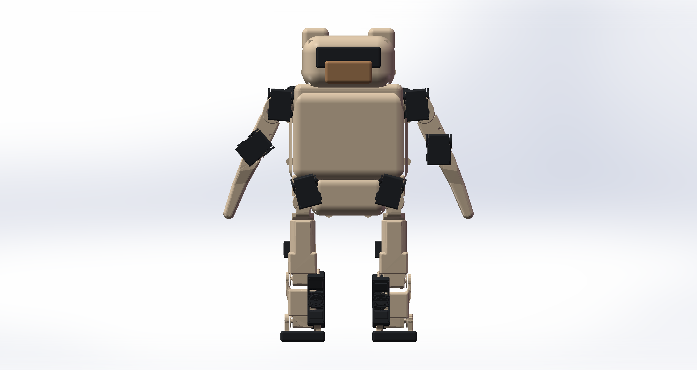

# Zeroth-01 Round-v1 RL Mechanical Package

面向强化学习与机械审阅的 Zeroth-01 16DoF 冻结模型：圆润头/胸/骨盆外壳、8 mm 加厚鞋底、真实 FEETECH STS3250 CAD、URDF、原生 MuJoCo MJCF、质量/质心/惯量、关节/舵机坐标、碰撞策略、打印件和便携 SolidWorks 装配均在本仓库内。



## 当前结论

| 状态 | 结论 |
|---|---|
| `rl_simulation_ready` | **PASS** |
| `solidworks_fk_review` | **PASS_WITH_HARDWARE_LIMITATIONS** |
| `round_shell_print_geometry_ready` | **PASS**，11/11 STL 为单组件、闭合、流形 |
| `complete_print_and_walk_kit_ready` | **FALSE**，公开 link STL 不是生产级承力零件/BOM |
| `hardware_walking_ready` | **FALSE**，仍需真机标定、称重、热/电流/冲击测试 |
| 运动自由度 | 16 个转动关节 |
| 圆润版名义质量 | 4.151924609464 kg |
| 推荐初始连续扭矩上限 | 1.2552512 N·m（STS3250 额定值的 80%，工程起点） |

## RL 直接入口

- URDF：[`generated/urdf/zeroth01_rl_round_v1.urdf`](generated/urdf/zeroth01_rl_round_v1.urdf)
- MuJoCo：[`generated/mujoco/zeroth01_rl_round_v1.xml`](generated/mujoco/zeroth01_rl_round_v1.xml)
- 执行器与 PD/随机化元数据：[`generated/config/zeroth01_actuator_metadata.json`](generated/config/zeroth01_actuator_metadata.json)
- STS3250 三档扭矩配置：[`generated/config/sts3250_round_v1_rl_profiles.json`](generated/config/sts3250_round_v1_rl_profiles.json)
- 质量、质心、惯量：[`generated/config/round_v1_mass_properties.json`](generated/config/round_v1_mass_properties.json)
- 关节轴心/轴线/候选总线 ID：[`reports/joint_servo_frames.csv`](reports/joint_servo_frames.csv)
- 碰撞策略/安全启动关节盒：[`generated/config/zeroth01_collision_policy.json`](generated/config/zeroth01_collision_policy.json)
- 实机标定模板：[`generated/config/zeroth01_hardware_calibration_template.csv`](generated/config/zeroth01_hardware_calibration_template.csv)
- 完整 RL 交接：[`RL_ROUND_V1_HANDOFF_zh.md`](RL_ROUND_V1_HANDOFF_zh.md)

## CAD、SolidWorks 与打印

- 便携 SolidWorks 总装：[`generated/solidworks/portable_flat_round_v1/OPEN_FIRST_ZEROTH01_ROUND_V1_WITH_STS3250.SLDASM`](generated/solidworks/portable_flat_round_v1/OPEN_FIRST_ZEROTH01_ROUND_V1_WITH_STS3250.SLDASM)
- 28 个依赖 SLDPRT 与总装在同一目录；其中 `FEETECH_STS3250.SLDPRT` 是真实舵机 B-Rep。
- STS3250 原始 STEP：[`source_assets/vendor/sts3250/FEETECH_STS3250.step`](source_assets/vendor/sts3250/FEETECH_STS3250.step)
- 11 个圆润件 STEP：[`generated/cad/round_v1/parts/`](generated/cad/round_v1/parts/)
- 11 个最终打印 STL：[`generated/print/round_v1/final/`](generated/print/round_v1/final/)
- 打印与装配边界：[`PRINT_AND_ASSEMBLY_READINESS_zh.md`](PRINT_AND_ASSEMBLY_READINESS_zh.md)

SolidWorks 中原模型看似“很多碎片”，是因为 17 个公开 link STL 被导入为三角面片/表面体；它们是按运动链聚合的可视网格，不代表已有完整的舵机支架、舵盘、反侧轴承、紧固件和线束生产零件。本仓库的新圆润件与 STS3250 是原生 B-Rep；运动审阅由 CLI/COM 前向运动学驱动组件变换，未声称上游表面网格具备可维护的原生 Mate/Motion Study。


## 已通过的门禁

- 16 关节 × 101 点运动/动力学/轴向碰撞扫描：PASS。
- 100,000 个确定性随机安全盒姿态：0 个非白名单自碰撞。
- 65,536 个安全盒角点：0 个非白名单自碰撞。
- 48 个 SolidWorks lower/zero/upper 姿态：48/48 PASS。
- 16 个 STS3250 轴线共线：PASS；壳体绕轴 phase 仍需实物/B-Rep 确认。
- 11 个打印 STL：闭合、流形、绕序一致，STEP/STL 体积误差 < 0.5%。
- Linux 大小写敏感网格路径：27/27 URDF、27/27 MJCF 引用 PASS。
- 100,000 个准静态姿态的最坏重力矩：0.3398686768 N·m（右髋 pitch）。

这些是离散采样与名义刚体证据，不是连续空间数学证明，也不覆盖线束、螺钉头、打印公差、壳体变形、落脚冲击和热饱和。

## 快速验证

```bash
python scripts/validate_rl_package_portability.py \
  --urdf generated/urdf/zeroth01_rl_round_v1.urdf \
  --mjcf generated/mujoco/zeroth01_rl_round_v1.xml

python -m pip install -r requirements-validation.txt
python scripts/smoke_test_round_v1_mujoco.py
```

## STS3250 是否能走

当前只能得出“静态重力矩有余量，值得进入 RL 动态验证”，不能得出“真机一定能走”。训练先限制在 1.2552512 N·m，再用 1.569064 N·m 额定档复测；2.0 N·m 是历史仿真上限，4.903325 N·m 是堵转值，二者都不能当连续硬件能力。策略训练后必须输出每关节扭矩-速度、RMS 电流、温升、母线压降、足部冲量、回差和跟踪误差。

## 一句话交接

见 [`RL_PROMPT.txt`](RL_PROMPT.txt)。

## License / provenance

本项目新增代码、文档和圆润 CAD 以 MIT 发布；Zeroth/KScale 与 step.parts 来源资产保留各自版权和许可证，详见 [`THIRD_PARTY_NOTICES.md`](THIRD_PARTY_NOTICES.md) 与 [`LICENSES/`](LICENSES/)。
