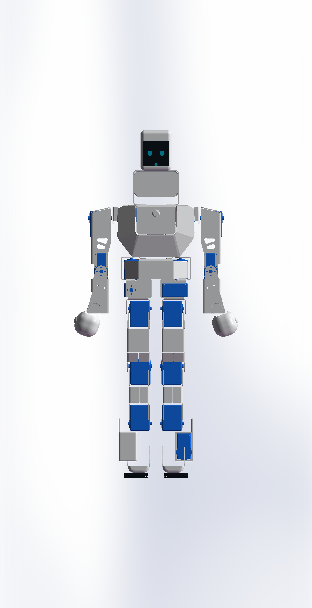
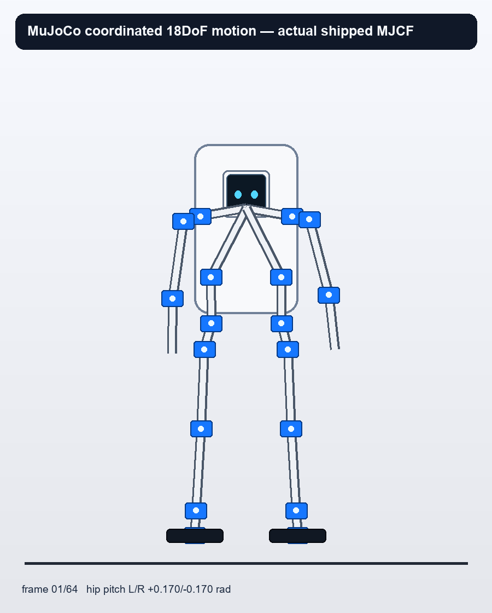

# Zeroth-01 Physical Mount v3 RL-Fixed

这是本仓库唯一推荐的 RL 机械基线。v3 保留已经装配过的 Zeroth-01 v2 承力骨架和原 16 个关节的完整 `xyz/rpy/axis/limit`，只增加两个串联踝横滚关节、加厚轻量脚底、固定 Q 版手和可采购的 M5Stack StackChan K151 交互头。旧的大胸前外观板、自制头和爪子已经删除，不得再作为训练或制造入口。



## 冻结结果

| 项目 | v3 值 |
|---|---:|
| 可动关节 | 18 个 revolute joint |
| 执行器 | 18 × FEETECH STS3250-C001，蓝色独立零件 |
| 原 v2 关节保真 | 16/16 完整六维位姿、轴和限位保持 |
| 新踝横滚 | 左右各 1 轴，位于踝俯仰轴正下方 50.000 mm |
| 标称整机质量 | 3.095471828 kg |
| 原 Zeroth-01 目标范围 | 3.0–3.3 kg |
| STS3250 额定扭矩 | 1.569064 N·m @ 12 V |
| RL 连续设计上限 | 1.2552512 N·m/关节 |
| 64 帧准静态峰值 | 1.186408681 N·m，左踝俯仰，连续值的 94.52% |
| 头部固定负载 | K151 0.187 kg + 6061 转接板 0.018 kg |
| 坐标 | X 向前、Y 向左、Z 向上 |

训练只读取以下五个入口：

- `generated/urdf/physical_mount_v3_rl_fixed/zeroth01_physical_mount_v3_rl_fixed_18dof.urdf`
- `generated/mujoco/physical_mount_v3_rl_fixed/zeroth01_physical_mount_v3_rl_fixed_18dof_mjx.xml`
- `generated/config/physical_mount_v3_rl_fixed_actuator_layout.json`
- `generated/config/physical_mount_v3_rl_fixed_rl_handoff.json`
- `reports/physical_mount_v3_rl_fixed/release_gates.json`

`actuator_layout.json` 给出 S01–S18 的关节名、所有者刚体、中立轴心、世界轴、质量和待实机标定字段。URDF/MJCF 中的质量、质心和惯量目前是可训练的名义估计，不是实测值。

## 验证结论

- SolidWorks 33.0.0 原生装配：51/51 组件、18 个独立蓝色 STS3250、旧爪 0、Q 手 2。
- SolidWorks 原生干涉：机械相交体积为 0。仅保留 3 条 K151 玻璃/表情/摄像孔显示参考层重叠，它们不制造、不计质量、不进入碰撞体。
- URDF ↔ SolidWorks 中立位：PASS；最大链接位移残差低于 `7e-10 mm`；S01–S18 的 URDF 视觉件全部使用同一个尺寸受控 STS3250 mesh，其 18 组完整 6D 安装变换与 SolidWorks 清单一致。
- MuJoCo：18 actuator、总质量相等、脚底齐平、逐轴低/中/高限位采样无非地面穿透。
- 64 帧协调运动和准静态逆动力学：PASS；动态步行仍需 RL rollout 的峰值/RMS 扭矩和热流日志。



核心报告：

- `reports/physical_mount_v3_rl_fixed/solidworks_gate.json`
- `reports/physical_mount_v3_rl_fixed/solidworks_interference_gate.json`
- `reports/physical_mount_v3_rl_fixed/fk_manifest_gate.json`
- `reports/physical_mount_v3_rl_fixed/coordinated_motion_evidence.json`
- `reports/physical_mount_v3_rl_fixed/sts3250_quasistatic_torque_gate.json`
- `reports/physical_mount_v3_rl_fixed/release_gates.json`

## SolidWorks 主文件

- 正常外观：`generated/solidworks/physical_mount_v3_rl_fixed/portable_flat/OPEN_FIRST_ZEROTH01_V3_RL_FIXED_CONNECTED_WHITE_18_BLUE_STS3250.SLDASM`
- 可选透视：`generated/solidworks/physical_mount_v3_rl_fixed/portable_flat/OPTIONAL_XRAY_ZEROTH01_V3_RL_FIXED_18_BLUE_STS3250.SLDASM`
- 51 组件外部件清单：`generated/cad/physical_mount_v3_rl_fixed/ZEROTH01_V3_RL_FIXED_18DOF_FULL_ASSEMBLY_MANIFEST.json`
- 新制 STEP/STL：`generated/cad/physical_mount_v3_rl_fixed/parts/`

配色用于装配识别：白色为承力骨架/外件，蓝色为 18 个 STS3250 和输出连接，橙色为计算模块，紫色为电池，绿色为躯干 IMU，黑色为脚底和 K151 屏幕。透视图用于检查这些内部件，不是额外的可打印壳体。

## 采购头和连接

K151 是完整采购模块，不需要打印头壳：54.0 × 70.5 × 61.5 mm、187 g，含 2 英寸彩色触摸屏、GC0308 摄像头、双麦克风、1 W 扬声器、接近/环境光、9 轴 IMU、Wi‑Fi/BLE、电池和两轴反馈舵机。步行时锁定内部 pan/tilt 中位，把整头作为 187 g 固定负载；交互模式再解锁。

唯一新增机械接口是 `stackchan_k151_torso_adapter_3mm_6061.step`：66 × 60 × 3 mm 6061，K151 侧 4 × Ø3.4 mm 对应 48 × 32 mm M3 孔矩，躯干侧使用四条 3.4 × 12 mm 闭口槽。URDF 连接链为“躯干 → 转接板 → K151”，没有外挂长脖子；旧胸前板已经移除。

官方依据：

- [M5Stack K151 产品页](https://shop.m5stack.com/products/stackchan-kawaii-co-created-open-source-ai-desktop-robot)
- [M5Stack StackChan 文档](https://docs.m5stack.com/en/StackChan)
- [K151 官方结构文件](https://github.com/m5stack/M5_Hardware/tree/master/Products/K151_StackChan/Structures)
- [K151 官方软件](https://github.com/m5stack/StackChan)
- [FEETECH STS3250 官方规格](https://www.feetechrc.com/en/562636.html)

## 物理发布边界

数字 RL 基线为 PASS，但实机制造仍保留以下 HOLD：

1. 采购一颗 STS3250，用 `sts3250_first_article_gauge.step` 复核 4×M2、25T/Ø5.9 输出、后轴和线束出口。
2. 先加工一块 K151 转接板，验证躯干闭口槽、M3 紧固、USB-C 和线束弯曲半径。
3. 装配后逐总成测量质量、质心和惯量，回填 URDF/MJCF。
4. 用 RL rollout 记录所有关节峰值/RMS 扭矩、速度、电流和热量；准静态 PASS 不等于动态步行签核。

完整首件顺序见 `ASSEMBLY_GUIDE_zh.md`，采购表见 `PROCUREMENT_BOM.csv`，RL 会话一句话入口见 `one-seq.md`。

## 本地复核

```bash
python cad/physical_mount_v3_rl_fixed/build_v3_urdf.py
python cad/physical_mount_v3_rl_fixed/build_v3_mjcf.py
python cad/physical_mount_v3_rl_fixed/validate_v3_fk_manifest.py
python cad/physical_mount_v3_rl_fixed/validate_v3_release.py
python cad/physical_mount_v3_rl_fixed/validate_v3_sts3250_torque.py
python cad/physical_mount_v3_rl_fixed/render_v3_motion.py
```

打开 SolidWorks 正常或透视装配后，再运行 `validate_solidworks_v3_interference.py`。不要手改生成的 URDF/MJCF；修改生成器后重新生成并重跑全部门禁。
